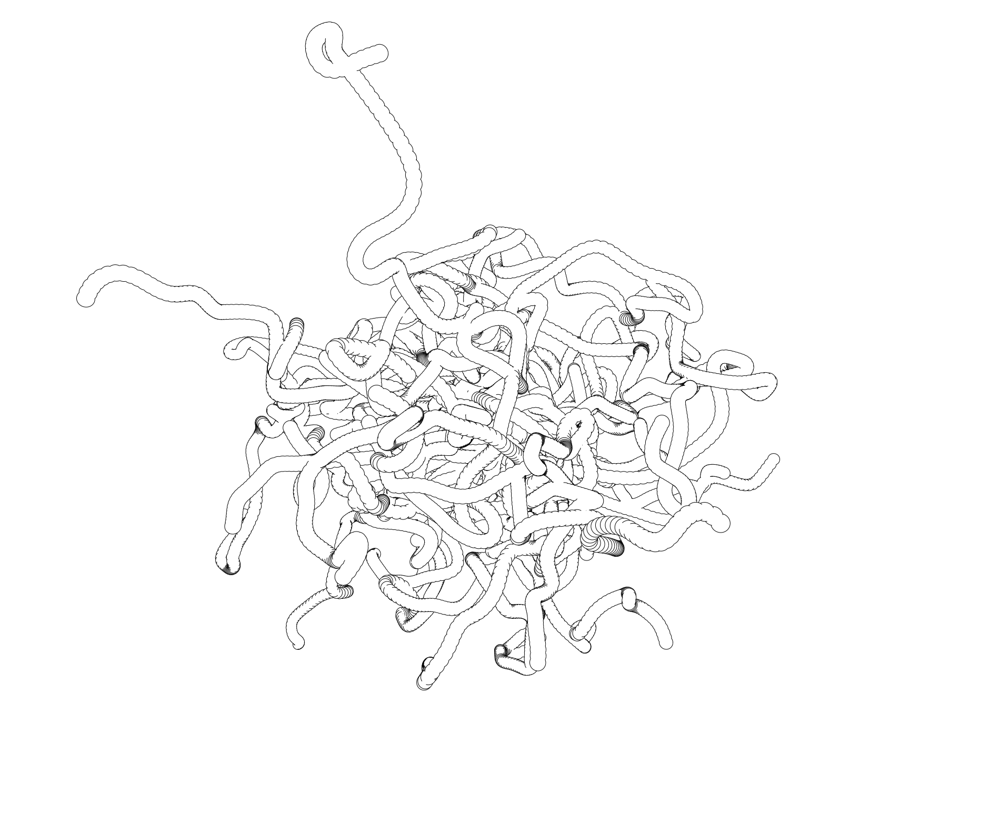

## lncpp

## WIP

This is a `c++` port of vector based 3d renderer [ln](https://github.com/fogleman/ln).
There are some differences with original implementation. `lncpp` is faster.

- [ x ] Cube
- [ x ] Sphere
- [ x ] Triangle
- [ ] Function shape
- [ ] Mesh shape
- [ ] Cylinder shape
- [ ] Cone shape
- [ ] Plane intersection methods
- [ ] STL File support
- [ ] Change tree implementation from pointer based representation to an array based (implicit representation)

### Usage

The sample programs are available under `examples`.

```sh
mkdir build && cd build
cmake ..
make -j$(nproc)
```

[]()
